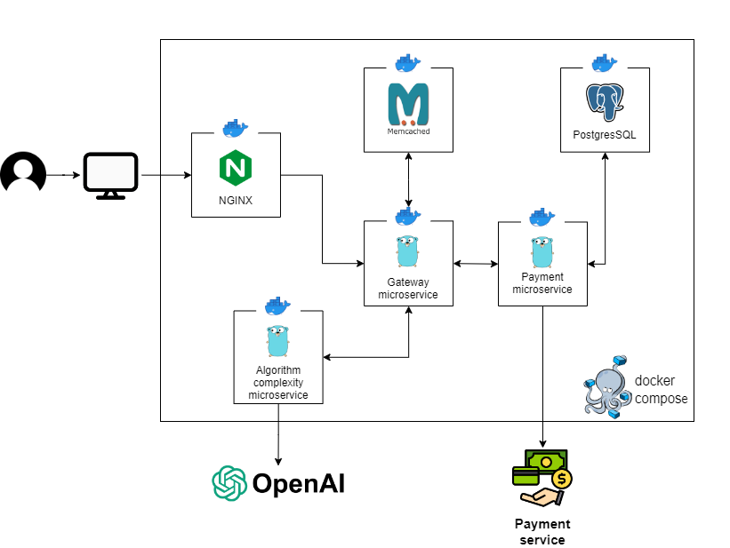

<!-- PROJECT LOGO -->
 

<h1 align="center">BigO</h1>
    

        Algorithm complexity calculation service
         
        <a href="https://github.com/rvinnie/bigO/issues">Report Bug</a>
        ·
        <a href="https://github.com/rvinnie/bigO/issues">Request Feature</a>
         
         
        
    

<!-- TABLE OF CONTENTS -->

  
Table of Contents

  <ol>
    <li><a href="#about-the-project">About The Project</a>
      <ul>
        <li><a href="#project-structure">Project Structure</a></li>
      </ul>
    </li>
    <li><a href="#roadmap">Roadmap</a></li>
    <li><a href="#contributing">Contributing</a></li>
    <li><a href="#contact">Contact</a></li>
  </ol>

<!-- ABOUT THE PROJECT -->
## About The Project

This project is a photo hosting implementation aimed at learning microservice architecture and devops culture.

Technologies used:
* [Golang](https://go.dev/)
* [PostgreSQL](https://www.postgresql.org/), [Memcached](https://memcached.org/)
* [gRPC](https://grpc.io/), [REST](https://ru.wikipedia.org/wiki/REST)
* [Docker](https://www.docker.com/)
* [OpenAI](https://openai.com/)
* [NGINX](https://nginx.org/), [JS](https://developer.mozilla.org/en-US/docs/Web/JavaScript), [HTML](https://developer.mozilla.org/en-US/docs/Web/HTML), [CSS](https://developer.mozilla.org/en-US/docs/Web/CSS)

<!-- PROJECT STRUCTURE -->
### Project Structure
The project consists of three microservices: ***gateway***, ***algorithm complexity***, ***payment***:
- ***gateway*** microservice is the central part of the application. All other parts of the application are associated with this service.
- ***algorithm complexity*** microservice communicates with OpenAI and calculates algorithm complexity.
- ***payment*** microservice communicates with payment service.

(<a href="#readme-top">back to top</a>)

<!-- ROADMAP -->
## Roadmap

- [ ] Add payment microservice
- [ ] Add sponsor entity
- [ ] Add caching of sponsors

<!-- CONTRIBUTING -->
## Contributing

Contributions are what make the open source community such an amazing place to learn, inspire, and create. Any contributions you make are **greatly appreciated**.

If you have a suggestion that would make this better, please fork the repo and create a pull request. You can also simply open an issue with the tag "enhancement".
Don't forget to give the project a star! Thanks again!

1. Fork the Project
2. Create your Feature Branch (`git checkout -b feature/AmazingFeature`)
3. Commit your Changes (`git commit -m 'Add some AmazingFeature'`)
4. Push to the Branch (`git push origin feature/AmazingFeature`)
5. Open a Pull Request

(<a href="#readme-top">back to top</a>)

<!-- CONTACT -->
## Contact

Alexey Fedoseev - [@fedoseev_alexey](https://t.me/fedoseev_alexey) - rv1nnie@yandex.ru

Project Link: [BigO](https://github.com/rvinnie/bigO)

(<a href="#readme-top">back to top</a>)

